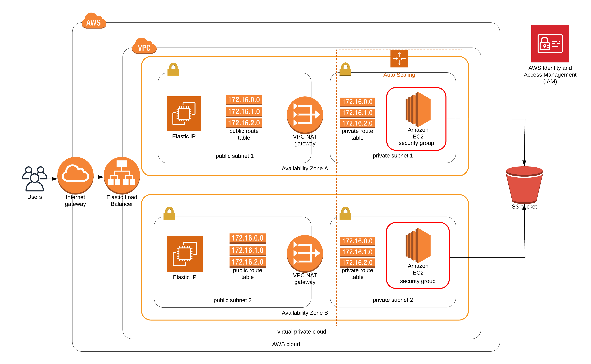
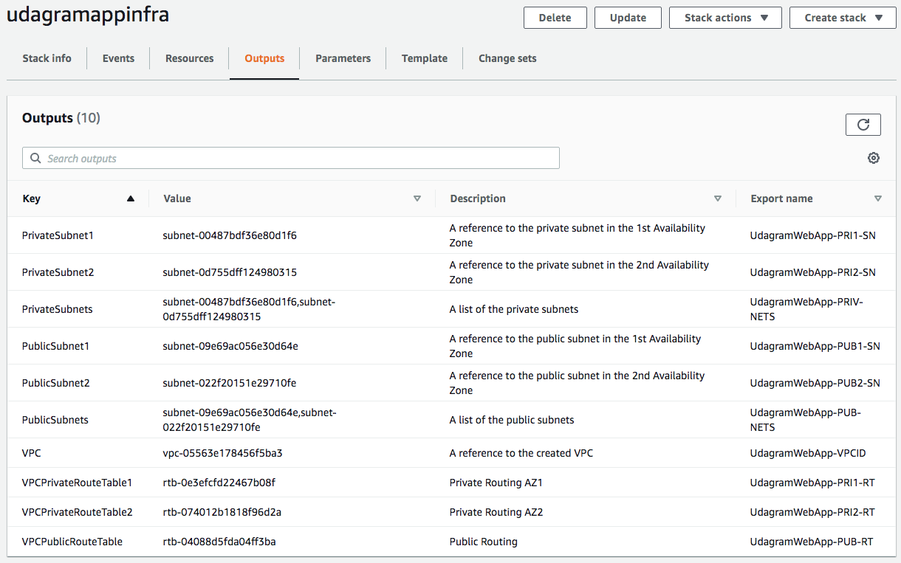
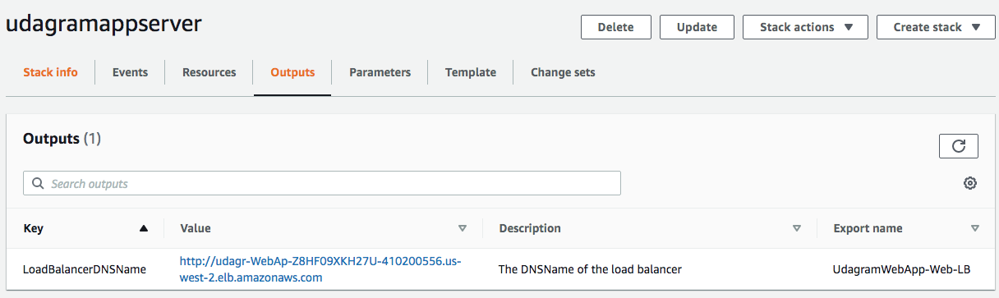
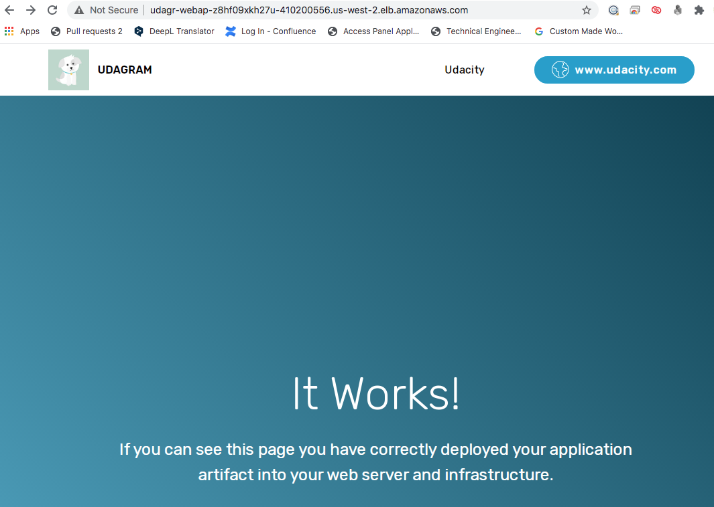

# depoly-web-app-cloudformation
Udacity Cloud DevOps Project 2

Create infrastructure diagram with Lucidchart



1. Assign the IAM role with AdministratorAccess policy [link](https://docs.aws.amazon.com/IAM/latest/UserGuide/getting-started_create-admin-group.html) 

2. Prepare network YAML file and JSON file, create infrastructure stack with aws cli

```sh
13:30 $ ./create.sh udagramappinfra network.yml network-parameters.json 
arn:aws:cloudformation:us-west-2:568484772557:stack/udagramappinfra/a0d4c420-eab5-11ea-a575-06945ba32212
```



3. Prepare server YAML file and JSON file, create servers stack with aws cli

```sh
13:56 $ ./create.sh udagramappserver servers.yml server-parameters.json 
arn:aws:cloudformation:us-west-2:568484772557:stack/udagramappserver/b2562940-eab6-11ea-abc9-0ac711d65b04
```



4. Visit the load balancer URL of the web app ([link](http://udagr-webap-z8hf09xkh27u-410200556.us-west-2.elb.amazonaws.com/))

